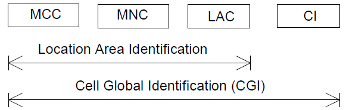
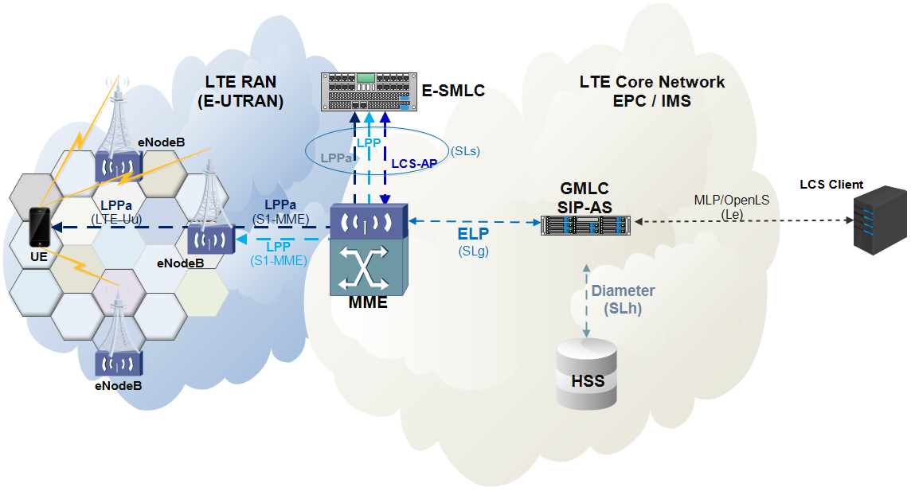
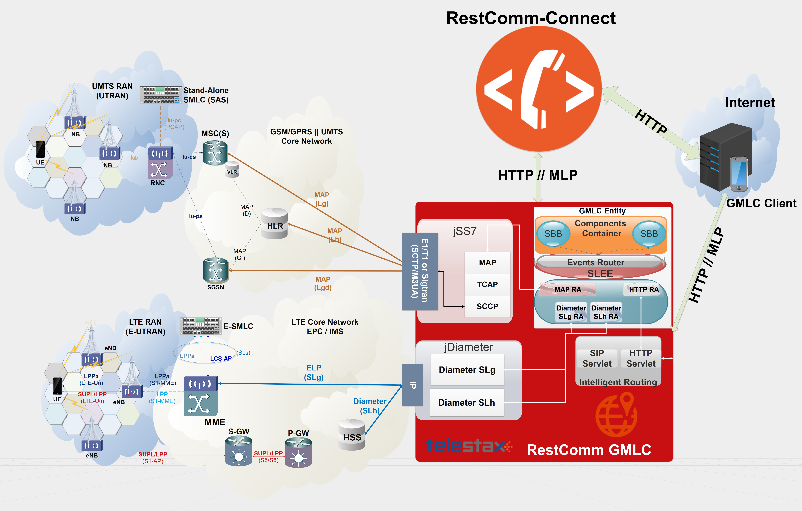
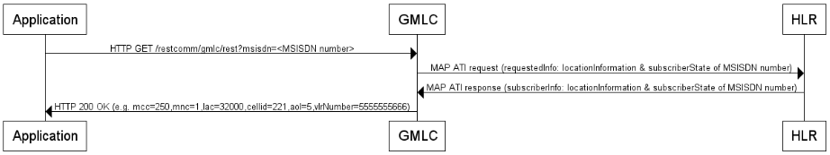

= GMLC 

[[_gmlc_overview]]
== Overview

GMLC stands for Gateway Mobile Location Centre and enables offering Location Based Services (LBS) to mobile subscribers roaming across several Mobile Network Operator's Radio Access Networks, regardless of the type of access (GERAN, UTRAN or E-UTRAN). 

Existing PLMN (Public Land Mobile Network) network elements are proprietary and run on non-standard operating environments located in trusted operator’s zones which make it difficult to build and deploy new applications. Also, these network elements do not provide the tools and interfaces needed to access and retrieve data from content providers over the Internet. The GMLC connects to these network elements and enables the flow of LCS messages to be extended to an open, standards-based Application Server (AS) located in the IP network. The AS also provides the tools and interfaces to enable access to content providers through the Internet. 

A GMLC is the first node an external LCS client accesses in a PLMN (Public Land Mobile Network). There may be more than on GMLC in a PLMN.   

The simplest location information a GMLC can retrieve is by issuing a MAP ATI (Any Time Interrogation) request to the HLR (Home Location register). MAP ATI is part of CAMEL phase 1. If the GMLC is allowed to proceed with the operation at the HLR, the latter will respond with the Cell Global Identity (CGI) as for the latest MAP Update Location operation carried out between the HLR and VLR at which the target mobile equipment is attached too (therefore, an additional parameter known as "Age of Location Information" is also included in the response). As shown in the figure below taken from 3GPP TS 23.003, CGI is made up of multiple components, namely, MCC (Mobile Country Code), MNC (Mobile Network Code), LAC (Location Area Code) and CI (Cell Identity). The combination of MCC and MCC represents the PLMN at which the cell is located, in other words, the country and Mobile Network Operator it belongs to. LAC represents a geographic location area in which a cluster of Base Transceiver Stations (BTS) are located for radio access, while CI, uniquely identifies the BTS providing service to the target subscriber in that area (more commonly known as cell). From CAMEL phase 4 compliance onward, MAP ATI can also retrieve the IMEI and MS Classmark.

CGI represents the location information with greatest error margin retrievable by a GMLC in GSM based core networks. 

As for 3GPP specs, hypothetically a Stand-Alone SMLC
can be placed within the BSC for triggering more precise location procedures, but in practice this is hardly found. More accurate positioning methods were developed for cellular networks, particularly from 3G (UMTS) and beyond. Naturally, accuracy comes with a price. When these dearer location capabilities are available, the GMLC may request routing information from the HLR via the Lh interface or HSS (Home Subscriber Server) via the SLh/Lh interface. 

image::images/LCS_2G-3G_interfaces.png[]

While Lh interface reside in a Circuit-Switched Core Network and therefore demands SS7 MAP operations, SLh is placed in the Evolved Packet Core (EPC) and is a Diameter-based interface for LTE location services, as specified by 3GPP TS 29.173. After performing registration authorization, it may send positioning requests to either VMSC (Visited Mobile Switching Centre), SGSN (Serving GPRS Support Node), MSCS (Mobile Switching Centre Server) or MME (Mobility Management Entity) and receives final location estimates from the corresponding entity via  the Lg, Lgd or SLg interface. Again, Lg/Lgd interfaces demand SS7 MAP operations while SLg is a Diameter-based interface for LTE location occupying ELP procedures, where ELP stands for EPC Location Protocol as specified by 3GPP TS 29.172.

Up to this point, what is known as "Immediate Location Request" has been covered. A GMLC can also handle "Deferred Location Request", which represents retrieving of location contingent on some current or future events where the response from the LCS Server to the LCS Client may occur some time after the request was sent, as described in 3GPP TS 23.271. When a deferred location request is triggered by the GMLC, event-based "Subscriber Location Reports", either conveyed through MAP or ELP are sent back to the GMLC by the entity at which the target mobile equipment is attached to (VMSC, MSCS, SGSN or MME).

Next figure exhibits TelScale GMLC (productized version of RestComm GMLC) architecture and interfaces with aforementioned entities and RestComm (and particularly, RestComm Geolocation API).

Finally, RestComm GMLC supports the following MAP and Diameter-based operations for LCS (Location Services) within Mobile Network Operators:

* MAP ATI: Any-Time-Interrogation, to gather Cell Global Identity, age of location information and state of the target mobile station from the HLR.
* MAP SRIforLCS: Send Routing Information for Location Services, to gather IMSI and core network entity address (MSC or SGSN) to which send further location request.
* MAP PSL: Provide Subscriber Location, to gather location information from the UTRAN (UMTS Terrestrial Radio Access Network), which should include, besides Cell Global Identity,  location estimates in geographic coordinates of the target User Equipment, depending on available positioning methods (e.g. E-OTD, OTDOA, UTDOA, A-GPS, etc.).
* MAP SLR: Subscriber Location Report, to gather location of a target User Equipment from the MSC or SGSN when a request for location is either implicitly administered or made at some earlier time in MAP PSL for event based deferred type of location.
* Diameter Routing Information Request/Answer (RIR/RIA): analogous to MAP SRIforLCS but over Diameter based SLh interface between GMLC and HSS.
* ELP Provide Location Request/Answer (PLR/PLA): analogous to MAP PSL but over Diameter-based Evolved Packet Core Location Protocol (ELP) SLg interface between GMLC and MME.
* ELP Location Report Request/Answer (LRR/LRA): analogous to MAP SLR, but over Diameter-based Evolved Packet Core Location Protocol (ELP) SLg interface between GMLC and MME.

== Message Flow

=== HTTP and MAP messages flow for GSM Location Services

GMLC service begins when the network sends an HTTP (GET/POST) request to the GMLC Gateway.

Next figure displays the signal flow between an application and RestComm GMLC within an GSM Core Network, from where location services are reduced to retrieving Global Cell Identity, Age of Location information and MSC/VLR address at which the target MSISDN is currently attached to, by means of a MAP ATI request to the HLR (subscriber’s state can be included in the response
if requested in MAP ATI, from which «assumedIdle», «camelBusy» or «notProvidedByVlr» are the available responses). The application, via a REST Web Service, delivers an HTTP GET request to RestComm GMLC. RestComm GMLC then performs a MAP ATI request to the concerning GSM Core Network HLR and receives the corresponding response with location information as previously stated.

A deeper look inside the messages exchanged as for the previous diagram is shown next (all information depicted are ficticious, as an example)

HTTP GET:
....
Internet Protocol Version 4, Src: 192.168.26.1, Dst: 192.168.26.128
Transmission Control Protocol, Src Port: 48200 (48200), Dst Port: 8080 (8080), Seq: 1, Ack: 1, Len: 509
Hypertext Transfer Protocol
    GET /restcomm/gmlc/rest?msisdn=59899077937 HTTP/1.1\r\n
        [Expert Info (Chat/Sequence): GET /restcomm/gmlc/rest?msisdn=59899077937 HTTP/1.1\r\n]
        Request Method: GET
        Request URI: /restcomm/gmlc/rest?msisdn=59899077937
        Request Version: HTTP/1.1
....

MAP ATI Request

....
IP 4, Src: 192.168.26.128, Dst: 41.188.110.5
SCTP, Src Port: 8012 (8012), Dst Port: 8011 (8011)
MTP 3 User Adaptation Layer (M3UA)
SCCP
    Called Party address
        SubSystem Number: HLR (Home Location Register) (6)
        Global Title 0x4 (9 bytes)
            Called Party Digits: 59899077937
    Calling Party address
        SubSystem Number: GMLC(MAP) (145)
        Global Title 0x4 (6 bytes)
            Calling Party Digits: 222333
TCAP
    begin
        dialogueRequest
            application-context-name: 0.4.0.0.1.0.29.3 (anyTimeInfoEnquiryContext-v3)
        components: 1 item
            Component: invoke 
                    invokeID: 0
                    opCode: localValue: 71
GSM MAP
    Component: invoke (1)
        invoke
            invokeID: 0
            opCode: anyTimeInterrogation (71)
            subscriberIdentity: msisdn (1)
                msisdn: 919598097739f7
            requestedInfo
                locationInformation
                subscriberState
            gsmSCF-Address: 91223233
....

MAP ATI Response

....
IP 4, Src: 41.188.110.5, Dst: 192.168.26.128
SCTP, Src Port: 8011 (8011), Dst Port: 8012 (8012)
MTP 3 User Adaptation Layer (M3UA)
SCCP
    Called Party address
        SubSystem Number: GMLC(MAP) (145)
        Global Title 0x4 (6 bytes)
            Calling Party Digits: 222333
    Calling Party address
        SubSystem Number: HLR (Home Location Register) (6)
        Global Title 0x4 (9 bytes)
            Called Party Digits: 59899077937
TCAP
    end
        Destination Transaction ID
        oid: 0.0.17.773.1.1.1 (id-as-dialogue)
        dialogueResponse
            application-context-name: 0.4.0.0.1.0.29.3 (anyTimeInfoEnquiryContext-v3)
            result: accepted (0)
        components: 1 item
            Component: returnResultLast
                    invokeID: 0
                    opCode: localValue: 71
GSM MAP
    Component: returnResultLast (2)
        returnResultLast
            invokeID: 0
            resultretres
                opCode: localValue (0)
                    localValue: anyTimeInterrogation (71)
                subscriberInfo
                    locationInformation
                        ageOfLocationInformation: 5
                        geographicalInformation: 104f01231f9a0e00
                        vlr-number: 915555556566
                        cellGlobalIdOrServiceAreaIdOrLAI: cellGlobalIdOrServiceAreaIdFixedLength: 52f0107d0000dd
                    subscriberState: assumedIdle (0)
                        assumedIdle
....

HTTP GET Response:

....
IP Version 4, Src: 192.168.26.128, Dst: 192.168.26.1
Transmission Control Protocol, Src Port: 8080 (8080), Dst Port: 48200 (48200), Seq: 230, Ack: 510, Len: 5
Hypertext Transfer Protocol
    HTTP/1.1 200 OK\r\n
        [Expert Info (Chat/Sequence): HTTP/1.1 200 OK\r\n]
        Request Version: HTTP/1.1
        Status Code: 200
        Response Phrase: OK
    [HTTP response 1/1]
    [Time since request: 0.341487879 seconds]
    [Request in frame: 10]
    HTTP chunked response
        Data chunk (61 octets)
        End of chunked encoding
        \r\n
    Data (61 bytes)  mcc=250,mnc=1,lac=32000,cellid=221,aol=5,vlrNumber=5555555666
....

The latter describes a success scenario, where the application gets the following answer to it HTTP GET tequest:

....
mcc=250,mnc=1,lac=32000,cellid=221,aol=5,vlrNumber=5555555666
....

Following, some non succesful HTTP GET responses are displayed:

MAP ATI response with Subscriber State but no Location Information received:
....
SubscriberState: SubscriberState [subscriberStateChoice=netDetNotReachable, notReachableReason=notRegistered]
....

MAP ATI response received with no Subscriber Information:
....
Unknown SubscriberInfo received: xxxx
....

Erroneous MAP ATI response received:
....
Unknown AnyTimeInterrogationResponse received: xxxx
....

MAP ATI response received with UnknownSubscriber error:
....
ReturnError: 1 : MAPErrorMessageUnknownSubscriber [, unknownSubscriberDiagnostic=imsiUnknown]
....

MAP ATI response received with other error messages:
....
ReturnError: <error code> : <MAP Error message description>  
ReturnError: 34 : MAPErrorMessageSystemFailure [networkResource=hlr]
....

When MSISDN is absent in the GET HTTP request - bad HTTP request syntax:
....
Invalid MSISDN specified
....

When a timeout occurs (e.g. no response from an HLR is received):
....
DialogTimeout
....

When other SS7 stack errors happen:
....
DialogReject: <description>
....
....
DialogProviderAbort: <description>
....
....
DialogUserAbort: <description>
....
....
RejectComponent: <description>
....

Next figure displays the analogous signal flow as the one explained before, but for an HTTP POST request including OMA MLP payload. 

Next figure displays the analogous signal flow as the one explained before, but including RestComm Geolocation API between the application and RestComm GMLC. Likewise, in this case, the MAP ATI request is triggered by RestComm by an HTTP POST request with MLP Standard Location Immediate Request (SLIR).

image::images/RestComm-GMLC-GSM_flow.png[]

Following, see an example of MLP payload included in HTTP POST request received by RestComm GMLC:

....
<?xml version="1.0" encoding="UTF-8"?>
<!DOCTYPE svc_init SYSTEM "MLP_SVC_INIT_310.DTD">
<svc_init xmlns="MLP_SVC_INIT_310.dtd">
	<hdr>
		<client>
       			<id>USERNAME</id>
       			<pwd>PASSWORD</pwd>
       			<serviceid>SERVICEID</serviceid>
     		</client>
   	</hdr>
   	<slir>
     		<msids>
       			<msid type="MSISDN">59899077937</msid>
     		</msids>
     		<eqop>
        		<resp_timer>15</resp_timer>
     		</eqop>
   	</slir>
</svc_init>
....

The corresponding answer to the MLP SLIR request (after reception of MAP ATI response from the HLR), i.e. the MLP SLIA (Standard Location Immediate Answer) is shown next:

....
<?xml version="1.0" encoding="UTF-8"?><!DOCTYPE svc_result SYSTEM "MLP_SVC_RESULT_310.DTD">
<svc_result xmlns="MLP_SVC_RESULT_310.dtd" ver="3.1.0">
    <slia ver="3.1.0">
        <pos>
            <msid>59899077937</msid>
            <pd>
                <time utc_off="-0300">20160828181421</time>
                <shape>
                    <CircularArea>
                        <coord>
                            <X>-1</X>
                            <Y>-1</Y>
                        </coord>
                        <radius>-1</radius>
                    </CircularArea>
                </shape>
            </pd>
        </pos>
    </slia>
</svc_result>
....

An MLP SLIA including an unsuccessful location information retrieval due to "Unknown Subscriber" error received in MAP ATI response is shown next.

....
<?xml version="1.0" encoding="UTF-8"?><!DOCTYPE svc_result SYSTEM "MLP_SVC_RESULT_310.DTD">
<svc_result xmlns="MLP_SVC_RESULT_310.dtd" ver="3.1.0">
    <slia ver="3.1.0">
        <result resid="4">UNKNOWN SUBSCRIBER</result>
        <add_info>ReturnError: 1 : MAPErrorMessageUnknownSubscriber [, unknownSubscriberDiagnostic=imsiUnknown]</add_info>
    </slia>
</svc_result>
....

An MLP SLIA including an unsuccessful location information retrieval due to "System Failure" error received in MAP ATI response is shown next.

....
<?xml version="1.0" encoding="UTF-8"?><!DOCTYPE svc_result SYSTEM "MLP_SVC_RESULT_310.DTD">
<svc_result xmlns="MLP_SVC_RESULT_310.dtd" ver="3.1.0">
    <slia ver="3.1.0">
        <result resid="1">SYSTEM FAILURE</result>
        <add_info>ReturnError: 34 : MAPErrorMessageSystemFailure [networkResource=hlr]</add_info>
    </slia>
</svc_result>
....

=== HTTP and MAP messages flow for UMTS Location Services

Following figure displays the signal flow between an application, RestComm Geolocation API and RestComm GMLC within an UMTS Core Network. The term RAN (Radio Access Network) might involve the RNC (Radio Network Controller), a Stand-Alone SMLC (Serving Mobile Location Centre), the NB (Node B -base station-) and the UE (User Equipment).

image::images/RestComm-GMLC-UMTS_flow.png[]

The terms MLP SLIR/SLIA and SLIREP stand for Mobile Location Protocol Standard Location Immediate Request/Response/Report as for OMA (Open Mobile Alliance) Mobile Location Protocol 3.2 specification.

=== HTTP and Diameter-based messages flow for LTE Location Services

Next figure displays the signal flow between an application, RestComm Geolocation API and RestComm GMLC within an EPS (Evolved Packet System) for LTE/LTE-Advanced location services. The Radio Access Network in this case involves positioning procedures involving the E-SMLC (Evolved SMLC), eNB (evolved NB), and the UE.

image::images/RestComm-GMLC-LTE_flow.png[]

[[_restcomm_gmlc_overview]]
== {this-platform} {this-application} 

[[_restcomm_gmlc_overview_features]]
=== Major Features

RestComm's implementation of GMLC is the first and only open source GMLC with a host of rich features and advantages. 

Java-based:::
  RestComm GMLC is the only Java based GMLC Gateway.
  It is robust and reliable and can be installed on any Operating System that supports Java (JDK 7 and SCTP). 

Open Source:::
  The Software is open-source, giving you the freedom to understand the code and customise it to your enterprise needs.
  It is supported by a vibrant Open source community. 

Carrier Grade Performance:::
  RestComm GMLC has been developed to be deployed at Mobile Network Operators around the world so as to process billions of LCS transactions every day.
  A single RestComm GMLC node can process up to 1500's LCS/sec and can be adapted to the needs of Communication Service Providers of different sizes in any country reducing  CAPEX and OPEX costs. 

Cloud Ready:::
  RestComm GMLC is Cloud-ready.
  It can be deployed on dedicated hardware, private cloud infrastructure or public IaaS such as AWS. 

SS7 Hardware Cards:::
  RestComm GMLC can be used with Intel family boards (Dialogic SS7 cards) or Zaptel/Dahdi compatible TDM devices (Digium, Sangoma).  For production its recommended to use Dialogic boards only. 

SIGTRAN (M3UA):::
  It also has in-built support for SIGTRAN (M3UA using SCTP).
  
Diameter-based SLh and SLg (ELP):::
  It also has in-built support for LCS in LTE networks.

HTTP interface:::
  HTTP interface is a common interface that can be used for connection with service applications. RestComm GMLC supports network/application/service initiated LCS requests.

MLP:::
  Location requests can be sent to the GMLC using plain XML over HTTP(S), with the request being encoded in OMA MLP (Mobile Location Protocol). See the full OMA MLP technical specification here: http://technical.openmobilealliance.org/Technical/technical-information/release-program/current-releases/mlp-v3-1

Easy Configuration and Management:::
  RestComm GMLC comes with an efficient Command Line Interface (CLI) tool allowing you to completely configure the  Gateway at run-time and manage it using simple commands rather than do everything manually.
   RestComm GMLC also comes with a Graphical User Interface that will allow you to configure, monitor and manage the Gateway through a convenient user-friendly interface. 

[[_mobicents_gmlc_overview_tech_spec]]
=== Technical Specifications

RestComm GMLC is not restricted by Transaction Per Second model.
The only restricting factor is memory + CPU capacity of the host servers, third-party applications or the underlying database service. 

* RestComm GMLC supports as many as 1073741823 incoming and 1073741823 outgoing concurrent sessions/dialogs.
* RestComm GMLC supports unlimited E1 links and the only limiting factor is the underlying TDM board used.
* RestComm GMLC SCTP supports as many associations as supported by the underlying Operating System.
  Can be setup in multihome.
* RestComm GMLC M3UA can be confgured to have as many ASP's / IPSP's as needed by the system.
* RestComm GMLC SCCP can be confgured to have virtually unlimited Global Title Translation rules and also supports wild characters for partial matching of Global Title digits.        

[[_mobicents_gmlc_overview_http]]
=== HTTP Transfer Mechanism

{this-platform} {this-application} makes use of HTTP protocol between the gateway and the third-party applications (or Value Added Service Modules). {this-platform} {this-application} receives location service requests from third-party applications and then translates these requests to SS7 MAP or Diameter based commands when applies. The HTTP callback mechanism allows the third-party application to be agnostic to Operating System, Programming Language and Framework.
The third-party application can be either of the following technologies on any Operating System: 

* Apache Tomcat, JBoss AS, Oracle Application Server, IBM Websphere, etc. for JSP/Servlet on Java 
* PHP
* Microsoft IIS for ASP
