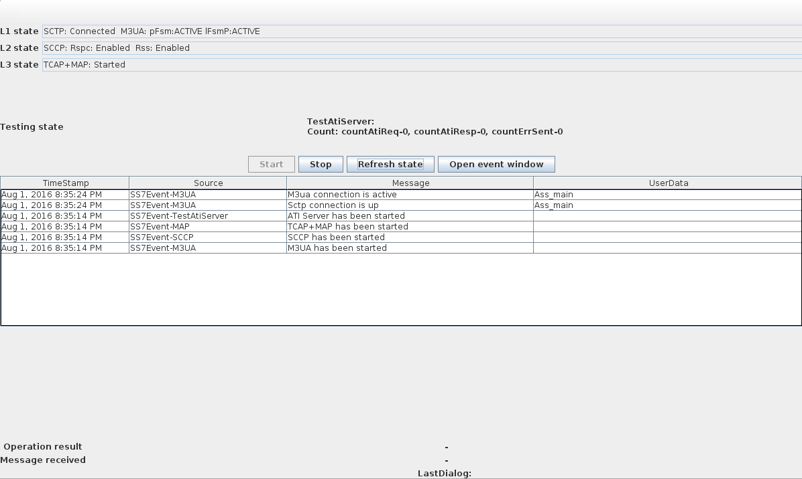
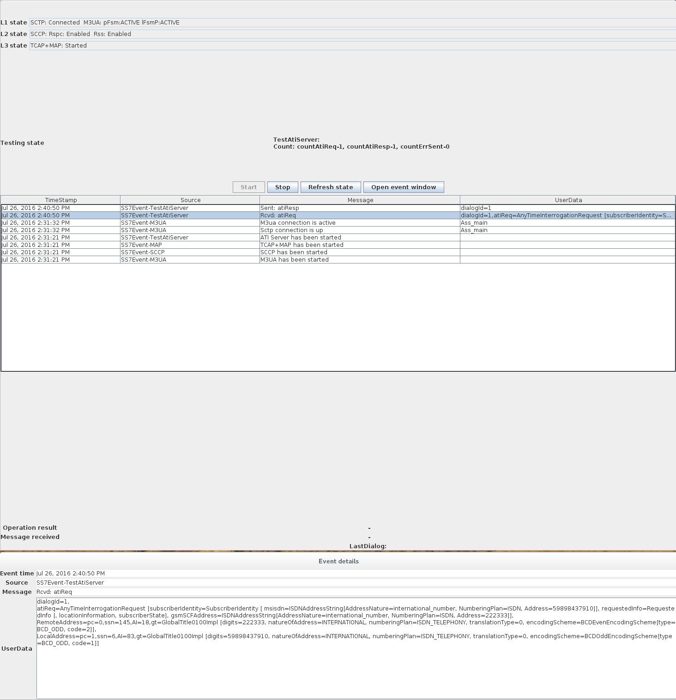
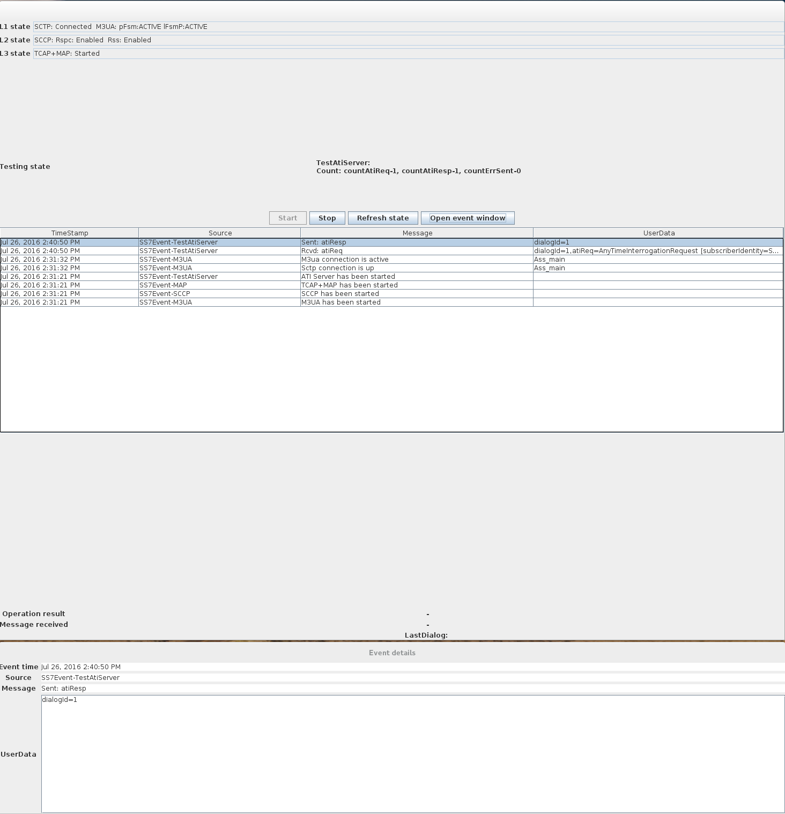

= Running
:doctype: book
:sectnums:
:toc: left
:icons: font
:experimental:
:sourcedir: .

== Running the Gateway

.Procedure: Run {this-platform} {this-application} 
. Pre-requisite: 
+
* You must have {this-platform} {this-application} installed as explained in the Installation Guide.
* If you are using the SS7 board on server, you must ensure that the `java.library.path` variable is set to point to the directory containing the native component.
  Alternatively you can copy it to the JBoss native library path manually.

. All you have to do to start the Gateway is start the JBoss Application Server.
  To start the JBoss Server you must execute the [path]_run.sh_ (Unix) or [path]_run.bat_ (Microsoft Windows) startup script in the installation directory [path]_{this-folder}-gmlc-/jboss-5.1.0.GA/bin_.
  Note that this will start the server in the default profile.
  The "default" profile is a clean profile where you start from scratch and configure the entire SS7 Stack and GMLC Gateway to suit your requirements. 
. Result: If the service started properly you should see the following last few output lines in the Unix terminal or Command Prompt depending on your environment: 
+
----

19:49:43,856 INFO  [ServiceManagementImpl] (main) Activated ServiceID[name=mobicents-gmlc,vendor=org.mobicents,version=1.0]
19:49:44,123 INFO  [ShellServer] (main) Starting SS7 management shell environment
19:49:44,124 INFO  [ShellServer] (main) ShellExecutor listening at /127.0.0.1:3435
19:49:44,175 INFO  [Ss7Management] (main) Starting ...
19:49:44,175 INFO  [MBeanHostImpl] (main) Found MBeanServer matching for agentId=jboss
19:49:44,175 WARN  [MBeanHostImpl] (main) Found non-matching MBeanServer with default domian = null
19:49:44,176 INFO  [Ss7Management] (main) Started ...
19:49:44,184 INFO  [MBeanHostImpl] (main) Registered MBean with ObjectName=org.mobicents.ss7:layer=ALARM,type=Management,name=AlarmHost
19:49:44,184 INFO  [Ss7Management] (main) Registered MBean: AlarmHost
19:49:44,192 INFO  [CounterProviderManagement-CounterHost] (main) Starting ...
19:49:44,192 INFO  [CounterProviderManagement-CounterHost] (main) CounterManagement configuration file path /home/telestax/RestComm/restcomm-gmlc-1.0.42/jboss-5.1.0.GA/server/default/data/CounterHost_CounterProvider.xml
19:49:44,207 INFO  [MBeanHostImpl] (main) Registered MBean with ObjectName=org.mobicents.ss7:layer=COUNTER,type=Management,name=CounterHost
19:49:44,211 INFO  [Ss7Management] (main) Registered MBean: CounterHost
19:49:44,243 INFO  [CounterProviderManagement-CounterHost] (main) Started ...
19:49:44,337 INFO  [MBeanHostImpl] (main) Registered MBean with ObjectName=org.mobicents.ss7:layer=SCTP,type=Management,name=SCTPManagement
19:49:44,338 INFO  [Ss7Management] (main) Registered MBean: SCTPManagement
19:49:44,366 INFO  [MBeanHostImpl] (main) Registered MBean with ObjectName=org.mobicents.ss7:layer=M3UA,type=Management,name=Mtp3UserPart
19:49:44,366 INFO  [Ss7Management] (main) Registered MBean: Mtp3UserPart
19:49:44,392 INFO  [MBeanHostImpl] (main) Registered MBean with ObjectName=org.mobicents.ss7:layer=SCCP,type=Management,name=SccpStack
19:49:44,392 INFO  [Ss7Management] (main) Registered MBean: SccpStack
19:49:44,397 INFO  [MBeanHostImpl] (main) Registered MBean with ObjectName=org.mobicents.ss7:layer=SCCP,type=Router,name=SccpStack
19:49:44,397 INFO  [Ss7Management] (main) Registered MBean: SccpStack
19:49:44,399 INFO  [MBeanHostImpl] (main) Registered MBean with ObjectName=org.mobicents.ss7:layer=SCCP,type=Resource,name=SccpStack
19:49:44,399 INFO  [Ss7Management] (main) Registered MBean: SccpStack
19:49:44,433 INFO  [TcapManagementJmx-TcapStack] (main) Starting ...
19:49:44,436 INFO  [MBeanHostImpl] (main) Registered MBean with ObjectName=org.mobicents.ss7:layer=TCAP,type=Management,name=TcapStack
19:49:44,437 INFO  [CounterProviderManagement-CounterHost] (main) Registered CounterMediator: Tcap-TcapStack
19:49:44,437 INFO  [Ss7Management] (main) Registered MBean: TcapStack
19:49:44,437 INFO  [TcapManagementJmx-TcapStack] (main) Started ...
19:49:44,530 INFO  [Http11Protocol] (main) Starting Coyote HTTP/1.1 on http-127.0.0.1-8080
19:49:44,566 INFO  [AjpProtocol] (main) Starting Coyote AJP/1.3 on ajp-127.0.0.1-8009
19:49:44,571 INFO  [ServerImpl] (main) JBoss (Microcontainer) [5.1.0.GA (build: SVNTag=JBoss_5_1_0_GA date=200905221634)] Started in 1m:35s:965ms
----		 
. If you are starting {this-application}-{project-version} for the first time, SS7 is not configured.
  You can use either the Shell Client or the GUI to connect to {this-application}-{project-version} and configure the SS7 Stack, GMLC parameters and Routing Rules.
  Once configured, the state and configuration of SS7 and GMLC are both persisted which stands a server re-start operation.
  The next chapter will discuss in detail about configuring SS7 and the GMLC Gateway.

.Procedure: Stop the Gateway
. To stop the {this-platform} {this-application} , you must shut down the JBoss Application Server.
  To shut down the server(s) you must execute the `shutdown.sh -s` (Unix) or  `shutdown.bat -s` (Microsoft Windows) script in the installation directory [path]_{this-folder}-gmlc-/jboss-5.1.0.GA/bin_.
. If the server stopped properly, you will see the following three lines as the  last output in the Unix terminal or Command Prompt: 
+
----
INFO  [ServerImpl] (JBoss Shutdown Hook) Shutdown complete
Shutdown complete
Halting VM
----

[[_running_the_gateway_simulator]]
== Running the Gateway - Simulator Profile

The {this-platform} {this-application} offers you an option to run the Gateway with a "simulator" profile for testing purpose.
The "simulator" profile is a pre-configured profile to work with the jss7-simulator.
Starting the Gateway with the "simulator" profile is similar to the steps explained for the "default" profile except that you must pass the string value "simulator" to the -c command line option when invoking the run script.
 
----

[bin]$ ./run.sh -c simulator
----            

By default, the GMLC Simulator profile is configured for use in Linux systems.
For using it in Microsoft Windows systems, you must configure the parameters as explained below. 

Open the file  [path]_{this-folder}-gmlc-<version>/jboss-5.1.0.GA/server/simulator/data/SCTPManagement_sctp.xml_ and replace in two places, the parameter `ipChannelType="0"` with `ipChannelType="1"` to enable TCP connection instead of SCTP since Windows does not support SCTP.
If you are using in a Linux system, there is no modification required to the settings. 

[[_simulator_gmlc_example]]
== Running GMLC Examples in Simulator

If you are not familiar with the {this-platform} jSS7 Simulator, you can find instructions about using the jSS7-simulator in the {this-platform} jSS7 User Guide.
You will also find example test cases explained in detail in the jSS7 User Guide.
In this section you will find a simple Location Service example explained using the jSS7 Simulator. 

.Procedure: Running {this-platform} jSS7 Simulator - MAP ATI TEST SERVER Example
. Change the working directory to the bin folder in the Simulator's installation directory. 
+
----
[vinu@vinu-neha ~]$ cd restcomm-gmlc-<version>/tools/restcomm-ss7-simulator/bin
----			
. Ensure that the [path]_run.sh_ start script is executable. 
+
----
bin$ chmod +x run.sh
----					 
. Execute the [path]_run.sh_ Bourne shell script with the command `./run.sh gui`.
+
----
bin$ ./run.sh gui
----
+
This will launch the Simulator GUI Application. 
. When the GUI shows up, select "main" (default) as host name [or type "win" as host name under Windows] and press the 'Start' button.
  The Simulator is already pre-configured to connect to the GMLC Gateway (running in simulator profile). Press 'Run test' and again click on 'Start' in the next screen.
  The Simulator will connect to GMLC (via a SIGTRAN SCTP/M3UA association). The Low layer is configured to SCTP (not TCP) protocol, therefore you can test the GMLC in a Linux environment.
  To test under Windows OS, you must change the SS7 simulator settings to TCP.
. After approximately 30 seconds you will see the appear two events in the the Simulator window log showing "Sctp connection is up" and "M3UA connection is active" as in figure below:  
+

. {this-platform} {this-application} is configured, in simulator mode, to process an HTTP GET to trigger a MAP ATI at the jSS7 Simulator, which will return a fake answer for the only purpose of testing. Assuming the server is running with no IP binding (i.e. it's running in loopback address 127.0.0.1), open a browser and perform an HTTP GET test, for example (msisdn can be any number except the dummy one reserved, i.e. 19395550113): http://127.0.0.1:8080/restcomm/gmlc/rest?msisdn=87583439

You should immediately receive the following testing response with GCI + Age of Location Information parameters: mcc=250,mnc=1,lac=32000,cellid=221,aol=5,vlrNumber=5555555666

If you check the SS7 simulator (where the MAP ATI was sent and responded back), you should be able to see the following request and response (click on "Open Event Window" on each event logged):

			
  
						

.Procedure: Running {this-platform} jSS7 Simulator - HTTP POST MLP Request
. You must first start the {this-platform} {this-application} in simulator profile.
----
[telestax@127 ~]$ cd restcomm-gmlc-<version>/jboss-5.1.0.GA/bin
[telestax@127 bin]$./run.sh -b 127.0.0.1 -c simulator
----			
. To send an OMA MLP request test, in the same path from where you just ran the server, issue the following command:

----
curl -X POST -d @mlpreq.txt http://127.0.0.1:8080/restcomm/gmlc/mlp
----

mlpreq.txt is like this (you may change the MSISDN):

----
<?xml version="1.0" encoding="UTF-8"?>
<!DOCTYPE svc_init SYSTEM "MLP_SVC_INIT_310.DTD">
<svc_init xmlns="MLP_SVC_INIT_310.dtd">
	<hdr>
		<client>
       			<id>USERNAME</id>
       			<pwd>PASSWORD</pwd>
       			<serviceid>SERVICEID</serviceid>
     		</client>
   	</hdr>
   	<slir>
     		<msids>
       			<msid type="MSISDN">59899077937</msid>
     		</msids>
     		<eqop>
        		<resp_timer>15</resp_timer>
     		</eqop>
   	</slir>
</svc_init>
----

You should immediately receive the following testing MLP response:

----
<?xml version="1.0" encoding="UTF-8"?><!DOCTYPE svc_result SYSTEM "MLP_SVC_RESULT_310.DTD">
<svc_result xmlns="MLP_SVC_RESULT_310.dtd" ver="3.1.0">
    <slia ver="3.1.0">
        <pos>
            <msid>59899077937</msid>
            <pd>
                <time utc_off="-0300">20160801211238</time>
                <shape>
                    <CircularArea>
                        <coord>
                            <X>27 28 25.00S</X>
                            <Y>153 01 43.00E</Y>
                        </coord>
                        <radius>5000</radius>
                    </CircularArea>
                </shape>
            </pd>
        </pos>
    </slia>
</svc_result>
----

[[_running_shell]]
== Running the Shell

You must start the Shell client and connect to the managed instance prior to executing commands to configure the Gateway.
Shell can be started by issuing the following command from [path]_{this-folder}-gmlc-/jboss-5.1.0.GA/bin_ directory: 

[source]
----
[$] ./ss7-cli.sh
----

Once console starts, it will print following information and await further commands:

----
version=7.0.1383,name=Restcomm jSS7 CLI,prefix=restcomm,vendor=TeleStax
----

Before issuing further commands you must connect to a managed instance.
For more details on connecting to an instance and for a list of all supported commands and details on configuring the SS7 stack refer to the {this-platform} SS7 Stack User Guide. 

[[_connect_gui]]
== Connect to a new Instance

You can connect to a new instance by entering the IP:Port values and then login credentials in the top left corner of the GUI.

[[_gui_security]]
== Authentication

{this-platform} {this-application} GUI Management Security is based on the JBoss Security Framework.

As of now, there is basic authentication offered (which is based on the JBoss Security framework). When you try to start the Web Console, you will be prompted to enter login credentials.
These credentials can be configured in the files [path]_jmx-console-roles.properties_ and [path]_jmx-console-users.properties_ located at [path]_{this-folder}-gmlc-<version>/jboss-5.1.0.GA/server/<profile>/conf/props/_. 

You can also change the authentication from flat file system to database by making necessary configurations in the file [path]_{this-folder}-gmlc-<version>/jboss-5.1.0.GA/server/<profile>/conf/login-config.xml_. 

For detailed instructions and to know more about JBoss Security Framework please refer to the JBoss Installation Guide  http://docs.jboss.org/jbossas/docs/Installation_And_Getting_Started_Guide/5/html_single/index.html#Basic_Configuration_Issues-Security_Service[here]. 

NOTE: Deafult user-id and password for GUI Management Console is admin and admin.
You can change the user-id and password in files  [path]_jmx-console-roles.properties_ and [path]_jmx-console-users.properties_  located at [path]_restcomm-gmlc-<version>/jboss-5.1.0.GA/server/<profile>/conf/props/_				
